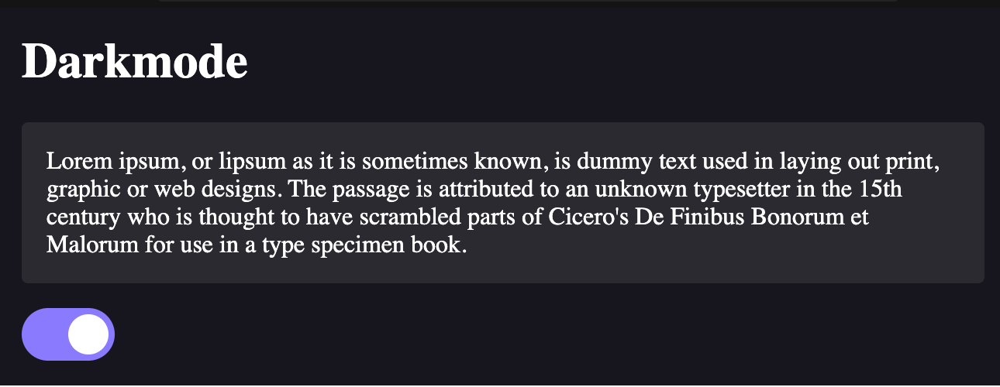
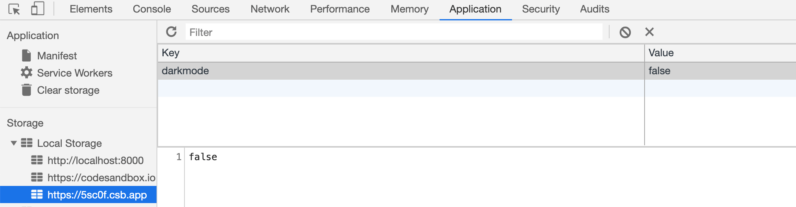

Let's learn how to build a darkmode switch using localstorage, React and React Hooks.

If you missed my last article, please be sure to check out <a href="/blog/react-hooks-slide-in-modal">How to Build a React Hooks Slide In Modal</a>.

## What we're building

<p></p>

## Setting up

Navigate to [codesandbox.io](https://codesandbox.io/) and create a React sandbox. From the left side panel, click on 'Add dependency' and then add 'styled-components'.

At the top of the `app.js`, import `styled` and `useState`, as follows:

```jsx
import React, { useState } from 'react';
import styled, { css } from 'styled-components';
```

We will utilze the `useState` React Hook, as well as `styled` and the `css` helper from `styled-components`.

## Create your components

Next, let's create our components:

```jsx
const Card = styled.div`
  background-color: var(--color-grey-1);
  border-radius: var(--global-radius);
  margin-bottom: 16px;
  padding: 16px;
  transition: background-color 0.3s ease-in-out;
`;

const AppWrapper = styled.div`
  padding: 16px;
`;
```

We can use these components as such:

```jsx
<AppWrapper>
  <h1>Darkmode</h1>
  <Card>
    Lorem ipsum, or lipsum as it is sometimes known, is dummy text used in laying out print, graphic
    or web designs. The passage is attributed to an unknown typesetter in the 15th century who is
    thought to have scrambled parts of Cicero's De Finibus Bonorum et Malorum for use in a type
    specimen book.
  </Card>
</AppWrapper>
```

## Add state

Next, we can pass a `darkmode` prop to the `<AppWrapper />` component, which we will use to toggle darkmode on and off.

To do this, first we need to add state using React Hooks. For now, we can set the default value to `false`:

```jsx
const [darkmode, setDarkmode] = useState(false);
```

Then in our component we can pass the darkmode prop here:

```jsx
<AppWrapper darkmode={darkmode}>
```

To make this work, we'll also need to add some conditional styles. Update your `<AppWrapper />` component like this:

```jsx
const AppWrapper = styled.div`
  padding: 16px;
  transition: background-color 0.3s ease-in-out;

  ${({ darkmode }) =>
    darkmode
      ? css`
          background-color: var(--color-darkmode-layer-1);
          color: var(--color-white);

          ${Card} {
            background-color: var(--color-darkmode-layer-2);
          }
        `
      : ''}
`;
```

Basically we are saying that when `darkmode` is set to `true`, we will apply the styles that are in between the `css` block.

`styled-components` also allows us to refer to components directly by adding `${ComponentName}`. This way, when `darkmode` is on, the background of the `<Card />` component will also be updated.

## CSS variables

On a sidenote, you probably noticed that we are using `var(--some-variable-name)` in our code. What is up with that?

This is a draft feature in the newest version of CSS which is supported by most major browsers except Internet Explorer. In order to use these variables, you need to define them in the `styles.css` file like this:

```css
:root {
  /* Colors */
  --color-primary: #8a7afe;
  --color-white: #fff;
  --color-grey-1: #ceced0;

  /* Darkmode */
  --color-darkmode-layer-1: #282829;
  --color-darkmode-layer-2: #666568;

  /* Globals */
  --global-radius: 4px;
}
```

Then you can use them wherever you want using the `var(--some-variable-name)`.

Check out the [MDN web docs about CSS variables](https://developer.mozilla.org/en-US/docs/Web/CSS/var) for more info about how this works.

## Adding the toggle switch

Instead of spending time creating our own css toggle switch, let's use one that is already built. Check out [w3schools on how to build a css switch](https://www.w3schools.com/howto/howto_css_switch.asp). All you need to do is copy and paste the css into your `styles.css` file, and add the following markup:

```jsx
<label className="switch">
  <input type="checkbox" />
  <span className="slider round" />
</label>
```

We will add the `onChange` function and `checked` logic in the final step.

## Add local storage and toggle function

Last, we will add our change handler and make use of `localstorage` to save the value of this setting. Like so:

```jsx
<label className="switch">
  <input 
    type="checkbox" 
    onChange={handleToggleDarkmode} 
    checked={darkmode} 
  />
  <span className="slider round" />
</label>
```

The `handleToggleDarkmode` function will look like this:

```jsx
const handleToggleDarkmode = () => {
  const newDarkmodeValue = !darkmode;

  setDarkmode(newDarkmodeValue);
  setLSItem('darkmode', newDarkmodeValue);
};
```

Remember, `setDarkmode` is the update handler we defined in our `useState` statement:

```jsx
const [darkmode, setDarkmode] = useState(false);
```

`setLSItem` is actually a simple helper method that is using the `window.localstorage.setItem()` method. I also created a `fetchLSItem` helper:

```jsx
const fetchLSItem = (itemName) => window.localStorage.getItem(itemName);
const setLSItem = (itemName, value) => window.localStorage.setItem(itemName, value);
```

> Note: normally we would want to check if `window` and `localstorage` are defined before calling these methods, but for simplicity, we are ignoring that here.

Using these two methods, we can get the value of the saved `localstorage` item, and also update it by name.

For more information about this, check out the [MDN web docs on Window.localstorage](https://developer.mozilla.org/en-US/docs/Web/API/Window/localStorage).

## Fixing initial state

In order to ensure the user's setting is saved on page refresh, we need to update our logic a little:

```jsx
const initDarkmodeSetting = fetchLSItem('darkmode') === 'true';
const [darkmode, setDarkmode] = useState(initDarkmodeSetting);
```

This will use the `fetchLSItem` helper method to get the stored value of `darkmode`. If it is set to 'true', then darkmode was enabled by the user. Otherwise, it is either unset, or the user turned off darkmode.

Please note that localstorage saves values as strings, so even though we are storing `true` and `false` for the `darkmode` value, it is actually being converted to a string when it is stored.

By using `const initDarkmodeSetting = fetchLSItem('darkmode') === 'true';`, we are able to convert this back to a `boolean` value.

## Conclusion

And there you have it! A simple implementation of a darkmode switch that utilizes `localstorage` to save a user's preference.

As you can see, it is quite simple to implement this popular user feature. Please check the sections below for additional resources, links and access to the source code for this project.

## Additional Resources

If you are ever having trouble setting or fetching a `localstorage` item, you can use Chrome developer tools to inspect your application local storage.

To do so, open the developer tools and click on `Application`. And then click on the appropriate tab under `Local storage`.

<p></p>

From here you can clear your storage, or manually update and delete individual keys.

### Links

- [CSS variables (Candidate feature) - MDN web docs](https://developer.mozilla.org/en-US/docs/Web/CSS/var)
- [w3schools - How to build a css switch](https://www.w3schools.com/howto/howto_css_switch.asp)
- [Window.localstorage - MDN web docs](https://developer.mozilla.org/en-US/docs/Web/API/Window/localStorage)

### Source code

Use the following codesandbox to compare your code to mine.

<iframe
  src="https://codesandbox.io/embed/falling-forest-5sc0f?fontsize=14&hidenavigation=1&theme=dark"
  style="width:100%; height:500px; border:0; border-radius: 4px; overflow:hidden;"
  title="falling-forest-5sc0f"
  allow="accelerometer; ambient-light-sensor; camera; encrypted-media; geolocation; gyroscope; hid; microphone; midi; payment; usb; vr"
  sandbox="allow-forms allow-modals allow-popups allow-presentation allow-same-origin allow-scripts"
></iframe>

[](https://codesandbox.io/s/falling-forest-5sc0f?fontsize=14&hidenavigation=1&theme=dark)

As always, stay tuned for more updates and future posts!

<hr />

## Yamagata Developers Society

Are you interested in learning programming or connecting with engineers in Yamagata or Japan?

Come join us at Yamagata Developers Society. We have monthly meetups where you can learn about the latest technologies while making new friends.

Please check our <a href="/blog/about/">About page</a> for more information.
