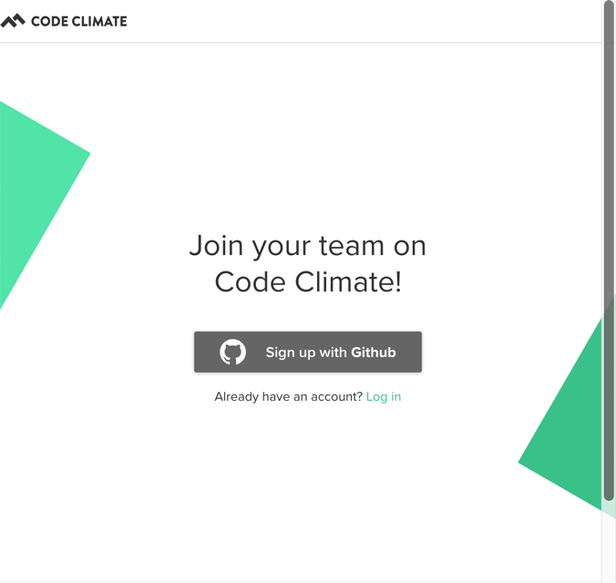
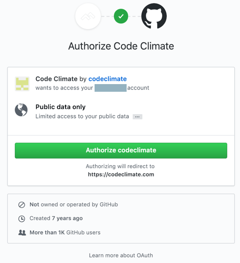
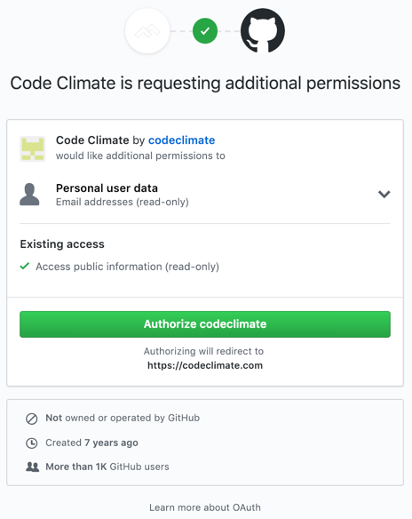
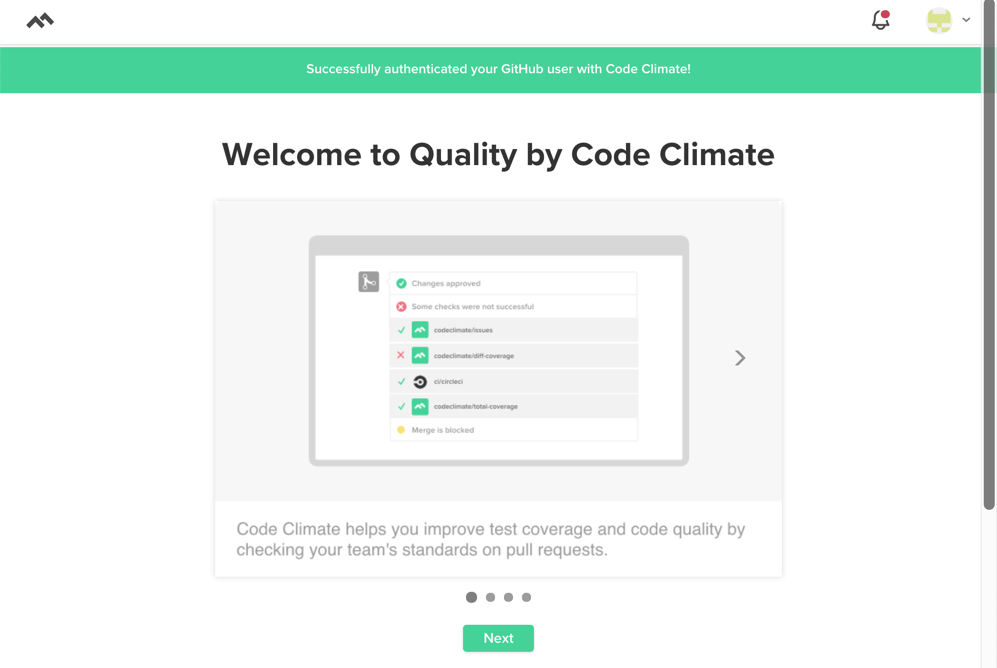
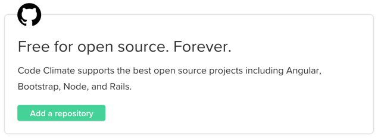
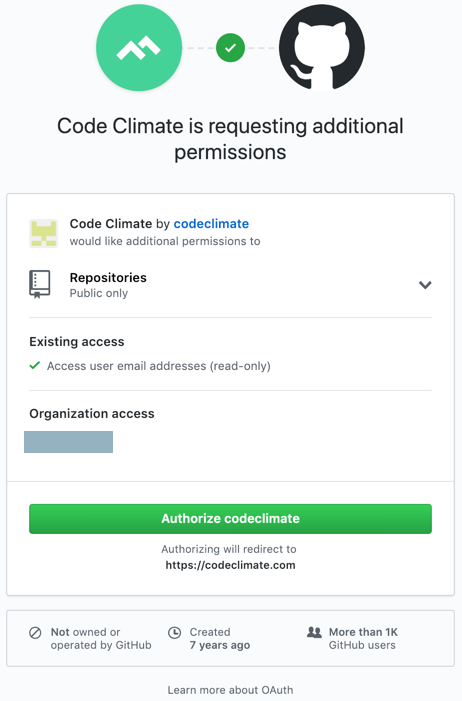
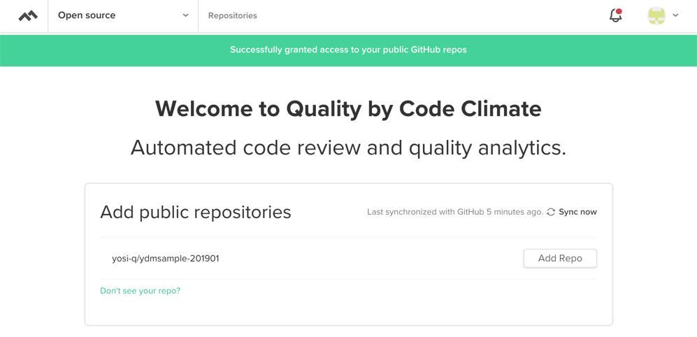
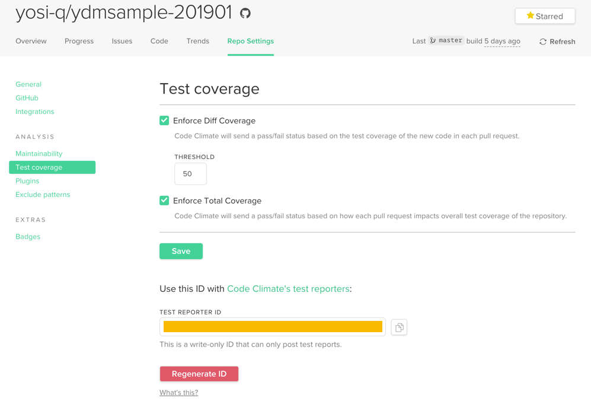

こんにちは、yosi-qです。

この記事では、CodeClimateのセットアップ方法について説明していきます。

## CodeClimate環境構築

Code ClimateのQualityチェックを導入します。

Code Climate Qualityのログイン画面 ( https://codeclimate.com/login/github/join ) で「Sign up with GitHub」でサインアップします。

「Authorize codeclimate」でGithubと紐付けます。

Additional Requestも許可しましょう。「Authorize codeclimate」を押下します。

次の画面が出れば登録完了。下部の「Next」を押下し、リポジトリ選択に進みます。

公開リポジトリは無料で使えますので、「Free for open source. Forever.」の「Add a repository」を押下します。

Additional Requestも許可します。「Authorize codeclimate」を押下します。

一覧に選択可能なリポジトリが表示されます。「Add Repo」を押下します。

設定としてはここまでで、Quality Checkは実施されるようになりましたが、**テストカバレッジはテスト実行結果を連携する必要があります。**
その際、「TEST REPORTER ID」が必要となりますが、下図のオレンジ部分から取得できます。

