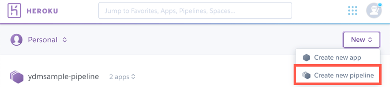
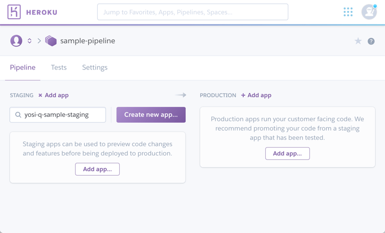
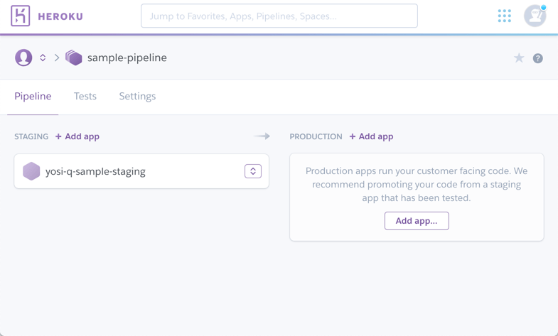

こんにちは、yosi-qです。

この記事では、Heroku Pipelineのセットアップ方法について説明していきます。

## そもそもPipelineとは？

[公式のDocs](https://devcenter.heroku.com/articles/pipelines)の冒頭では、下記のように挙げられています。（意訳）

> Pipelineは、同じコードベースを共有しているHeroku appsのグループです。Pipelineと> 関連づけられたそれぞれのappは、継続的デリバリー(CD)のワークフローにおける下記のステ> ージに位置付けられます。
>  - Development
>  - Review
>  - Staging
>  - Production

つまるところ、CDの各ステージにおける実行環境を作れると考えてもらえればよいのかなと思います。
特に、環境感のアプリケーション移行の点で力を発揮してくれます。

## Heroku Pipeline環境構築

まずはHeroku Pipelineを作ってみましょう。

Herokuのホーム画面で、 New > Create New Pipeline をクリックします。

Pipelineの名前を指定します。「Pipeline name」に名前を指定しましょう。
名前を指定したら、「Create Pipeline」ボタンでPipelineを作成します。

（Githubとの連携については、別の章で触れるとして、ここでは割愛します。）

Pipelineが出来上がると、下記の画面が表示されます。

次に、各環境にappを設定します。

まずはStageから。
「Add app...」ボタンを押すと、入力フィールドが出ます。

既存のAppを割り当てる場合は、既存のAPPの名前を入力すると指定できます。
新規作成する場合は、「Create new app...」ボタンを押すと、右側に作成用のViewが現れ、流れで作成ができます。

当然「App name」がavailableなことを確認して、「Create App」ボタンを押すと作成できます。
設定が済むと、こんな感じです。

同様にProductionも設定します。

Appの名前をクリックすれば、HerokuのAppの設定画面へ。

あとは通常のApp設定と同様、Add onをつけたりすれば良い感じです。

実際に動くコードが配置されていれば、Pipelineの「Promote to xxx...」(xxxはステージ。この場合はproduction＝本番出し)を押すことで、速やかにProductionへデプロイが行われます。

## そもそもHeroku Pipelineでできること

Heroku自身、[CI機能](https://devcenter.heroku.com/articles/heroku-ci)を持っていますので、それに追従させるという手はあり。

Pipelineの新規作成時、Githubのリポジトリを指定すると、PullRequestやコミット単位でAppがデプロイさせることもできます。
この場合、Development、またはReviewのステージができ、コミットしたタイミングでデプロイされるものを、StagingからProductionにリリースする形もできます。

[この記事](/dev-automation-and-ci-cd)では、Travis CIを使ってStageにデプロイ、Productionへは「Promote」ボタンで流すという形の環境を構築しました。
こちらもご参考いただければと思います。

