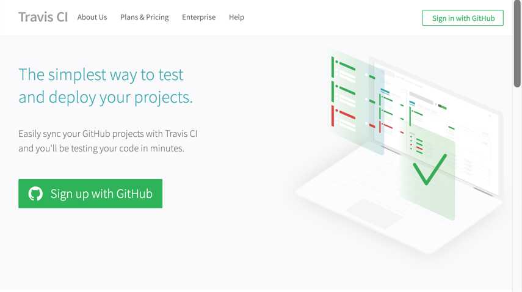
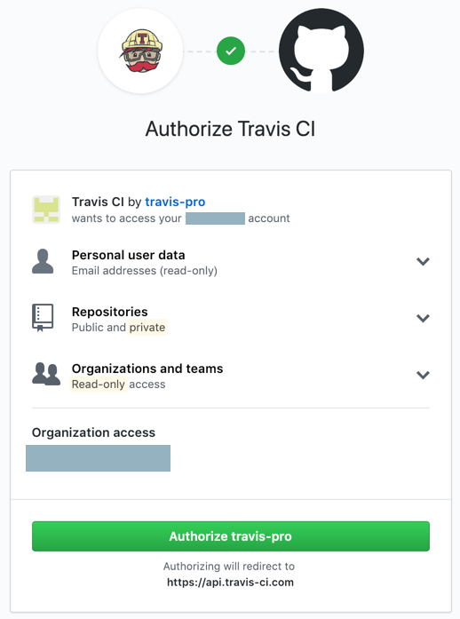
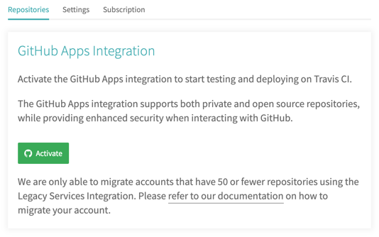
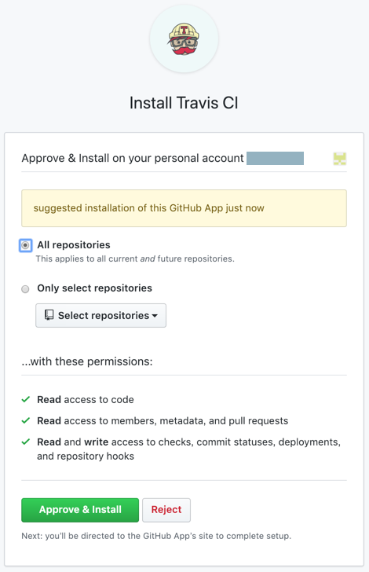
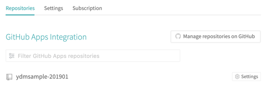
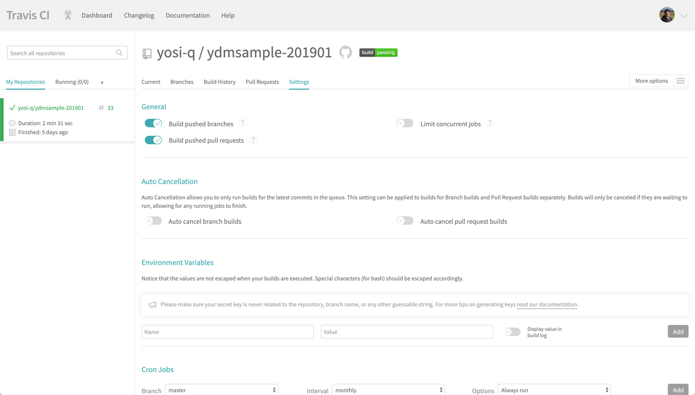

こんにちは、yosi-qです。

この記事では、Travis CIのセットアップ方法について説明していきます。

# Travis CI環境構築

Travis CI( https://travis-ci.com/ )の「Sign in with Github」から登録します。



「Authorize travis-pro」でGithubと紐付けます。



ユーザの画面に遷移したのち、画面の「Activate」ボタンを押下します。


「Approve & Install」ボタンを押下し、CI実行のトリガーとなるGithub上のリポジトリ参照ができるようにします。
この時、リポジトリ選択をすることができます。
 - All repositories: すべての公開リポジトリが対象
 - Only select repositories: 選択した公開リポジトリが対象



Travis CIへのリポジトリ参照が完了すると、下記の画面になります。
対象のリポジトリの左側にある「Settings」を押下し、設定を確認します。



「Build pushed branches」がON担っていることを確認しましょう。
この設定がONになっていれば、GithubへPushされたタイミングでCIが起動します。



以上で、Travis CIの設定は完了です。

# Travis CLI

Travis CIの設定は、`.travis.yml`に記載していくことになります。
外部アプリとの連携時に、パスワードなど一般公開したくないものには暗号化をかけたいものです。
そんな時に、Travis CLIを使うと、そんな希望を叶えてもらえます。

Rubyで開発されているので、Rubyの実行環境が必要ですが、  下記で簡単にインストールできます。

```
# gem install travis
```

詳細はTravis CLIの[本家ReadMe](https://github.com/travis-ci/travis.rb#readme)をご覧ください。


# その他

上記ではTravis CLIを紹介しましたが、他にもさまざまなツールが用意されています。
[本家Docs](https://docs.travis-ci.com/user/apps/)に紹介がありますので、合わせてご確認いただくと、
好みのものが見つかるかもしれません。。

# 関連記事

実際にTravis CIを使用した記事は[こちら](/dev-automation-and-ci-cd)です。
こちらでは、設定ファイルである`.travis.yml`についても内容を触れているので、合わせてご確認ください。
