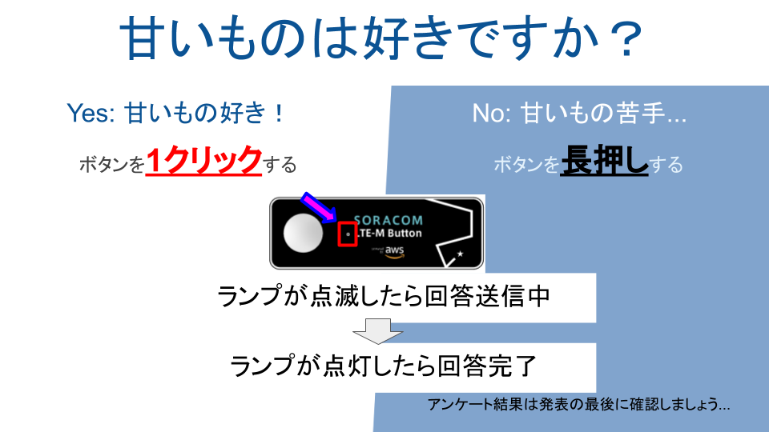
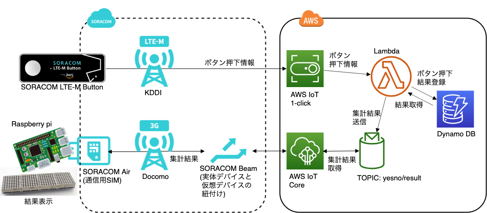

この記事は、 [Yamagata Developers Society Advent Calendar 2019](https://adventar.org/calendars/4619) 9日目の記事です。

YDSがほぼ毎月開催している YDS Developer Meetup Night! の2019年5月の会で、 
「IoT 101」というタイトルで、IoTに関する発表を行いました。  
発表では、IoTの概要と、デモとして用意した SORACOM LTE-M Button powered by AWS を使ったおもちゃを実際に使ってもらう形式でした。

今回のブログでは、デモシステムの概要について説明していきたいと思います。  
(すっかり共有が遅くなってしまい、申し訳ない。。。)

## デモシステムの概要

SORACOM LTE-M Button powered by AWS を使って、アンケートをとります。

アンケート結果は、全員回答後にボタンを2回押すことで、Raspberry piに繋いだLEDパネルで何パーセントの人がYesと答えたか表示します。  
(デバッグも兼ねて、全体回答数, Yes回答数, No回答数を最後に表示するようにしています。)

実際に動くと、こんな感じ。

<iframe width="560" height="315" src="https://www.youtube.com/embed/2dePh2b9rsY" frameborder="0" allow="accelerometer; autoplay; encrypted-media; gyroscope; picture-in-picture" allowfullscreen></iframe>

## デモシステムの構成

### SORACOM LTE-M Button側
- SORACOM LTE-M Buttonは、AWS IoT 1-Clickとのマッピングが簡単にできるようになっています。
- IoT 1-Clickがイベント検知すると、AWS Lambdaの関数を呼び出し、Dynamo DBにイベント情報を保管します。
- イベントが集計表示のものの場合、MQTTトピックに集計結果を送信します。

### Rasoberry pi側
- Raspberry piは、SORACOM Airを使った通信用SIMを接続。
- Raspberry piは、AWS IoT Coreにデパイスを登録するとともに、SORACOM Beamを使って、AWS IoT CoreのMQTTトピックを受け取れるように設定する。
- MQTTトピックから集計結果を受信し、LTEパネルに結果を表示する。

## 細かい設定やらコードやら
以下にいくつかまとめましたので、詳細知りたい方はご参照ください。

- GitHubに使用しているコード類は保管してあります。  
https://github.com/yosi-q/ydmsample-201905
- SORACOM LTE-M Buttonのセットアップ、AWSに関連する設定の一部はこちらに整理しています。  
https://qiita.com/yosi-q/items/1fb58a734f511a1716c5

発表で特に触れなかったのですが、本当であればIoTデバイスはAWS IoT CoreでShadowを使うことで、状態遷移(結果表示中とかなんとか)なども管理した方がいいのですが、  
今回のデモでは結果通知されるMQTTトピックだけを監視する形で簡略化しています。

## 発表内容の概要
以下は、デモ以外のことも興味がある人向けの内容です。

### IoT実現における課題
IoT実現において、いくつか課題がありますが、発表の中では、特に以下の課題に触れました。

- セキュリティ
  - インターネット上のセキュアな通信に関する点
- 限られたリソース
  - 容量の小さいCPU、メモリ、ハードディスクなど
  - 電力供給
- 端末管理
  - どのモノ(thing)からの通信か

いずれも項目単体で解決できるものではなく、それぞれのトレードオフを考慮しながら検討が必要なものです。

### デモシステムにおける課題の考慮点

限られたリソースという点について、今回のデモシステムでは、下記のような点を意識した構成としています。

- クラウドにおける集中処理による解決
  - モノ側のそれぞれの処理はシンプルに。(ボタンはどう押されたかを通知する、Raspberry piは集計結果を表示するだけの仕組み)
  - データの集計処理や結果の蓄積はAWS上のLambda, DynamoDBに任せる
- MQTTによる通信
  - データ量が小さい通信プロトコルの使用
- SORACOM Beamの利用
  - MQTT-MQTTS変換をすることで、暗号化にかかるリソース消費を抑える
  - 同時にセキュアさもカバー
- 計算リソースの消費を抑えることで電力消費を抑える

他にも、デモシステムでは下記をカバーしていることにもなります。

- Raspberry piの通信にSORACOM Airを使うことで、端末管理が容易になる(SIM=デバイス)
- ボタンの通信で使用しているLTE-MはLPWA(=Low Power Wide Area)の一つで、少ない消費電力で通信を可能にしている

もっぱら、SORACOMの機能のおかげでカバーできてる点が多いわけで、  
SORACOMサマサマ感ある。。

## 最後に

IoT、いろんな形でシステムが作られていますが、  
いざ自分が考えるとなると、単純なことをさせるデバイス（今回で言えばボタン）の活かし方を考えるのって実は結構難しい。  
いいアイディアが浮かんだら、また何か作ってみたいなと思ってはいますが、
自分の頭のカタさが悔しいです。
