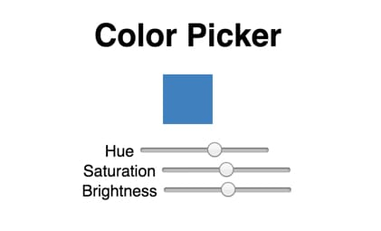

# React Hooks Color Picker

Today, I'll show you how you can build your very own color picker using React Hooks.

It is easy to build reusable, stateful components with React Hooks, which respond immediately to user interaction and are completely reusable.

Before diving in, let's take a second to review how to use the `useState` hook, since it will be the main ingredient in completing our project.

> Note: Hooks were added from React 16.8, so be sure you have at least this version of React installed if you have any trouble importing

## useState Hook

To get started, you will need to import the `useState` hook from react like so:

```js
import React, { useState } from react
```

After that, we can define our state as well as a function to update its value using destructuring:

```js
const [hue, setHue] = useState(50);
```

The first value, `hue` is our state value. `setHue` is our method to update the value of `hue`, and the value between the parenthesis in `useState()` is our initial value.

Previously, using class-based stateful components, one would do something like this:

```js
// To set the initial value
constructor() {
  this.state = {
    hue: 50,
  };
}

// To reference the value
const hue = this.state.hue;

// To update the value of this.state.hue
...
this.setState({
  hue: 51
});
```

Hooks simplifies all of that with a few brief lines of code:

```js
// To set initial value of state
const [hue, setHue] = useState(50);

// To reference that value
hue;

// To update the value of hue
setHue(51);
```

So, with that quick crash course about the `useState` Hook, let's get started coding our color picker.

## What we're building



This will be a very simple demonstration. At the top, we'll have a `ColorBox` component, which will show the current color and change dynamically with user interaction.
Below that, there will be three range sliders to adjust the `hue`, `saturation` and `brightness` of the `currentColor`.

## Adding state

As described above, we can use hooks to control the state of each range picker dimension. First, let's define our state in the `App` body, like so:

```js
const [hue, setHue] = useState(210);
const [saturation, setSaturation] = useState(50);
const [lightness, setLightness] = useState(50);
```

We can then create a const called `currentColor`, which we can pass later as a prop to our `ColorBox` component:

```js
const currentColor = `hsl(${hue}, ${saturation}%, ${lightness}%)`;
```

## RangeInput component

Next, let's create a range input component, since it will be reused 3 times.

```jsx
const RangeInput = ({ label, value, max = 100, onChange }) => {
  return (
    <div>
      <label>{label}</label>{' '}
      <input
        type="range"
        value={value}
        min={0}
        max={max}
        onChange={e => {
          onChange(e.target.value);
        }}
      />
    </div>
  );
};
```

I set `max = 100` by default, since for two of the range sliders, 100 is the max. For hue, on the other hand, the max value will go to 360, so we can pass props as such to define this one:

```jsx
<RangeInput label="Hue" value={hue} onChange={setHue} max={360} />
```

The other inputs will look like this:

```jsx
<RangeInput
  label="Saturation"
  value={saturation}
  onChange={setSaturation}
/>

<RangeInput
  label="Brightness"
  value={lightness}
  onChange={setLightness}
/>
```

## ColorBox component

For the `ColorBox` component, I will use `styled-components`. You can add this dependency by doing `npm install styled-components`. With this library, we can not only create the basic styles for this component, but also pass the current color we defined above as props, as such:

```js
const ColorBox = styled.div`
  background-color: ${({ currentColor }) => currentColor};
  height: 50px;
  margin: 0 auto 16px;
  width: 50px;
`;
```

For more information about how to use styled-components, see <a href="https://www.styled-components.com/docs/basics#adapting-based-on-props" target="_blank" rel="noopener">Adapting styled components based on props</a>.

We can then pass the current color through props, and the background color of this component will automatically update when the value of hue, saturation or brightness changes.

```jsx
<ColorBox currentColor={currentColor} />
```

## Summing up

And there you have it! With a few lines of code you have your own custom color picker made with React Hooks.

Of course, `useState` is not the only React Hook out there. To go further with your React Hooks studies, please check out the official <a href="https://reactjs.org/docs/hooks-intro.html" target="_blank" rel="noopener noreferrer">React Hooks docs</a>at reactjs.org.

## Live demo

Below you will find a working demo to compare your code to. Feel free to fork the project and continue building and customizing as you learn more about React and React Hooks!

<p>
  <iframe
    src="https://codesandbox.io/embed/cool-burnell-t4lef?fontsize=14&hidenavigation=1&theme=dark"
    style="width:100%; height:500px; border:0; border-radius: 4px; overflow:hidden;"
    title="cool-burnell-t4lef"
    allow="geolocation; microphone; camera; midi; vr; accelerometer; gyroscope; payment; ambient-light-sensor; encrypted-media; usb"
    sandbox="allow-modals allow-forms allow-popups allow-scripts allow-same-origin"
    class="loading-element shimmer-animation"
  ></iframe>
</p>

## Yamagata Developers Society

Are you interested in learning programming or connecting with engineers in Yamagata or Japan?

Come join us at Yamagata Developers Society. We have monthly meetups where you can learn about the latest technologies while making new friends.

Please check our <a href="/blog/about/">About page</a> for more information.

## Advent calendar

During the month of December 2019, we are doing an advent calendar with brand new posts from our members each week.

Check out our <a href="https://adventar.org/calendars/4619">Advent calendar schedule</a> to get a sneak peak at upcoming posts!!
