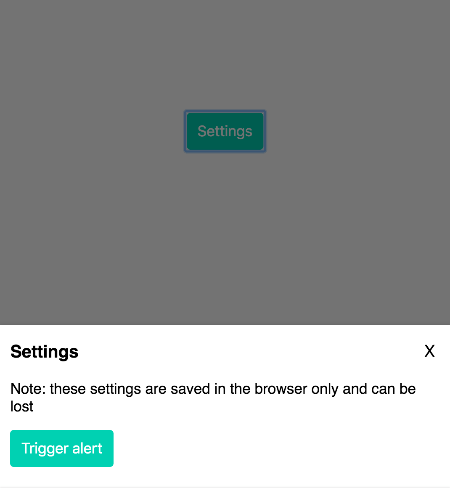

Continuing our studies of React Hooks, today I'll show you how to build a slide-in modal, which is useful for anything from a notification or popup to a settings display for users.

If you missed my last article, please be sure to check out <a href="/blog/react-hooks-color-picker">How to build a color picker using React Hooks</a>.

## What we're building

<p></p>

In order to build this component, we will use the `useState` hook like before.

We can use this hook not only for toggling the display of our slide-in modal, but also for the background overlay. And we can use the same hook to conditionally set class names -- which we can then use for simple CSS transition animations.

## Setting our state

To start, let's set our state value and update function:

```js
const [displayModal, setDisplayModal] = useState(false);
```

We set the initial state to `false`, since the slide-in modal will only display after the user clicks on a button.

## Modal styles and animations

I will keep the styling for the modal fairly simple:

```css
.Modal {
  position: fixed;
  bottom: -150vh;
  background-color: #fff;
  width: 100%;
  left: 0;
  padding: 0 12px 12px;
  transition: bottom 0.3s ease-out;
  z-index: 10;
}
```

I set the initial position to `bottom: -150vh`, so that by default the modal is positioned 150% of the view height out of frame.

I also set a simple transition effect, `transition: bottom 0.3s ease-out;` so that there will be a slide-in animation when the modal is triggered.

## Conditional rendering

There are two ways we can go about this. The first is most basic:

```jsx
{
  displayModal && <div className="Modal">...modal content</div>;
}
```

This is a concept in React known as "conditional rendering". If the value of `displayModal` is set to true, then the element will display on the page. If false, the component will not be rendered at all.

This is very useful for many different situations. However, one limitation to this approach is that we can't animate the component as its display state is toggled on and off (without using `react-transition-group` or another animation library).

To add animations then, we can use conditional rendering of class names! I will reformat the above code as follows:

```jsx
//
<div className={`Modal ${displayModal ? 'Show' : ''}`}>...modal content</div>
```

Applying the same concept as above, we will conditionally render the classname `Show` if `displayModal` is `true`.

From here, all we need to do is add this to our css:

```css
.Modal.Show {
  bottom: 0;
}
```

And with that we have a nearly complete slide-in modal!

## Overlay

What modal would be complete without a background overlay to partially block the content of the page while it is open?

We will use the exact same concepts as above. Let's start with the css:

```css
.Overlay {
  background-color: rgba(0, 0, 0, 0.55);
  top: 0;
  bottom: 0;
  left: 0;
  right: 0;
  position: fixed;
  display: none;
  z-index: 5;
}

.Overlay.Show {
  display: block;
}
```

And the markup will use the same conditional rendering of class names as the modal:

```jsx
<div className={`Overlay ${displayModal ? 'Show' : ''}`} />
```

## Closing the modal

Of course if we want our modal to be useful, we need a way to open and close it, right?

Let's create a button with a click handler which will toggle our `displayModal` state:

```jsx
<button className="Button CenterAlign" onClick={() => setDisplayModal(!displayModal)}>
  Settings
</button>
```

We simply use the `onClick` attribute, and our `setDisplayModal()` state updater function.

To close the modal, we can create two more click handlers:

The first will be a close icon within the modal:

```jsx
<button className="Close" onClick={() => setDisplayModal(!displayModal)}>
  X
</button>
```

We can set another on the overlay component so that when a user clicks on the background they can close the modal as well:

```jsx
<div
  className={`Overlay ${displayModal ? 'Show' : ''}`}
  onClick={() => setDisplayModal(!displayModal)}
/>
```

## Summary

It's hard to believe how easy it is to create reusable compoenents like this using React Hooks and basic CSS styling.

And you can probably imagine how easy it would be modify this so that the modal slides in from the right, left or top of the page!

In fact, you would really only have to update the css a little if you wanted to do something like that.

Another way to take this project further is to modify the component so that you can pass a prop like `left`, `right`, `top`, or `bottom` to determine which side the modal would slide-in from.

How would you go about doing something like that? Try to figure it out on your own using some of the concepts we've covered in the last 2 lessons!

## Source code

Use the following codesandbox to compare your code to mine. I also added an alert component, which gives you a sneak peak at a topic I will cover in future posts: the `useEffect` React Hook.

<p>
  <iframe
      src="https://codesandbox.io/embed/slide-in-modal-njw2l?fontsize=14&hidenavigation=1&theme=dark"
      style="width:100%; height:500px; border:0; border-radius: 4px; overflow:hidden;"
      title="slide-in-modal"
      allow="geolocation; microphone; camera; midi; vr; accelerometer; gyroscope; payment; ambient-light-sensor; encrypted-media; usb"
      sandbox="allow-modals allow-forms allow-popups allow-scripts allow-same-origin"
      class="loading-element shimmer-animation"
    ></iframe>
</p>

[](https://codesandbox.io/s/slide-in-modal-njw2l?fontsize=14&hidenavigation=1&theme=dark)

As always, stay tuned for more updates and future posts!

<hr />

## Yamagata Developers Society

Are you interested in learning programming or connecting with engineers in Yamagata or Japan?

Come join us at Yamagata Developers Society. We have monthly meetups where you can learn about the latest technologies while making new friends.

Please check our <a href="/blog/about/">About page</a> for more information.

## Advent calendar

During the month of December 2019, we are doing an advent calendar with brand new posts from our members each week.

Check out our <a href="https://adventar.org/calendars/4619">Advent calendar schedule</a> to get a sneak peak at upcoming posts!!
