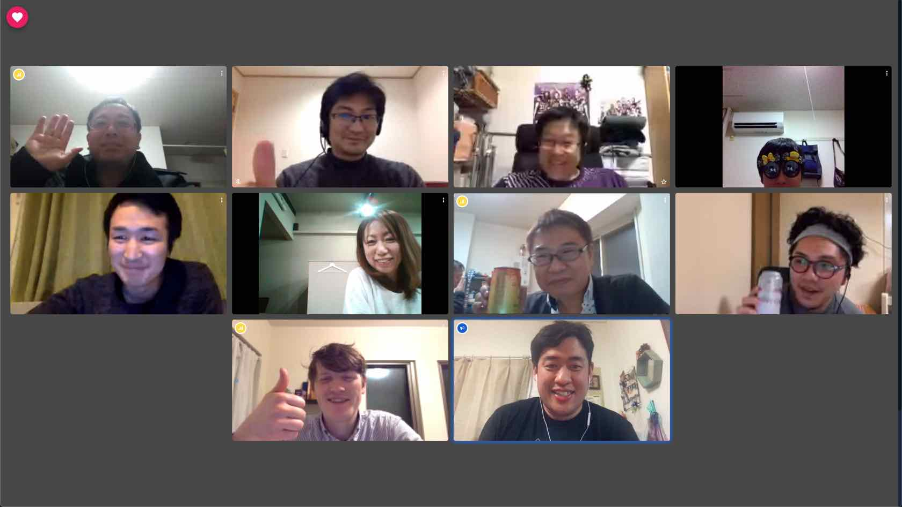

# Yamagata Developer's Online Meetup! - April 2020

2020 年 04 月 26 日(土)に Yamagata Developer's Online Meetup! (2002 年 4 月開催分）が開催されました。  

## リモート形式での開催

これまでの meetup は、コワーキングスペース too を会場に Yamagata Developer's Meetup Night! として実施してきましたが、
今回はコロナウィルス感染防止のため、リモート形式での開催となりました。  
これまで数人がリモートから参加するなどは実施したことはあったものの、全員がリモートの形は初開催ということで、
最初にツールの説明や、グランドルールなどを確認してからスタートしました。

### Web会議ツール 「j-mee」

今回の Online Meetup では、株式会社ゼタントが提供している「[j-mee](https://j-mee.zettant.com/)」を利用して実施しました。  
提供社のメンバーである加藤さんより、j-meeの概要と簡単な使い方などの説明をいただき、全員でツールの使用感を確認しました。

j-mee は、オープンソースの [Jitsui](https://github.com/jitsi) を採用しており、
PCであればブラウザを通して会議の開催、プレゼンテーション資料の共有などができます。  

## ショートプレゼンテーション

### #1 React.jp を使って「 Darkmode Switcher 」を作ろう！ - Elliott Hindman

Yamagata Developer Society幹事である Elliott さんからは、これまでライブコーディングで React.js を使った開発を何度も説明いただき、
React.js, React Hooks, Styled Components など、過去の発表からの積み重ねの内容にもなっているので、復習にもなっています。  
今回も [CodeSandbox](https://codesandbox.io/) を実際に使いながら、英語での発表していただきました。 

今回のテーマは「 Darkmord Switcher 」ということで、Webサイトをブラウザで参照する際にダークモードで見せるスイッチを実装する内容でした。  
これまでの発表で出ている React.js, React Hook, Styled Component に加え、 CSS 変数 (カスタムプロパティ), HTML5 の Local Strage を活用します。

いつも通り、 CodeSandbox のプレビューを見ながら開発しながら改善されていく様子が見れ、使っていくイメージがとても持ちやすい発表でした。  
今回の発表内容は [Build a Darkmode Switch](build-darkmode-switch) で紹介されています。(英語の記事です。)  

### #2 Web のアクセス解析に必要な Web ビーコンを実装してみたよ - 渡辺 信生

これまで何度か meetup に参加いただいており、今回初めての発表を行っていただいた渡辺さんは、  
東京の会社に所属しながら、山形でのリモートワーク生活を早くから実践されているエンジニアさん。

Web ビーコンは、PCやスマホといった端末、閲覧者の識別しつつ、閲覧行動の捉える Web 計測ツールの一種。   
実在するサービスを例にした概要説明と、実際に作られた Webビーコン の計測ツールの実現方法を紹介いただきました。

Web ビーコンの実例として、具体的なタグの内容などに触れていただき、概要からわかりやすい説明でした。  
また、実現方法として AWS のサービスを利用しており、利用されたサービスの特徴や tips も参考になるお話でした。

### #3 Googleの検索結果をリッチに！ 構造化データマークアップ入門 - 伊藤大貴

これまでの meetup の中で、SEO 関連の発表をしてくださる伊藤さん。  
今回は Google 検索の結果で多く見られるようになってきたリッチリザルト表示のための、構造化データについて紹介いただきました。

YDS のブログのコンテンツをリッチリザルト表示させる例を用いて、  
構造化データの作り方について、概要とツールの紹介と操作概要を説明いただきました。

## 振り返り

通常通りであれば、懇親会となりますが、今回はリモート開催ということで、参加者の近況や、今回の meetup 通しての感想をシェアしました。

今回の meetup 通しての感想では、以下のような声が挙がりました。

- 大きな問題なく開始から終了までスムーズに実施できてよかった。(商用で十分使えそうだね！という意見も。)
- 発表者側からすると、聞く側の反応が見えず発表しづらかった。
- リモートの良さも感じられる。特に、遠方の人も参加しやすいのがよい。

最後に、今回の参加メンバー全員で集合写真を撮りました。

# 次回の Meetup 開催について

今後の Meetup は、[Coworking space too の Facebook ページ](https://www.facebook.com/as.works.2015/)などで公開予定です。  
今後もコロナウイルスに対する対応状況に応じて、場合によってはリモート開催を検討しています。
