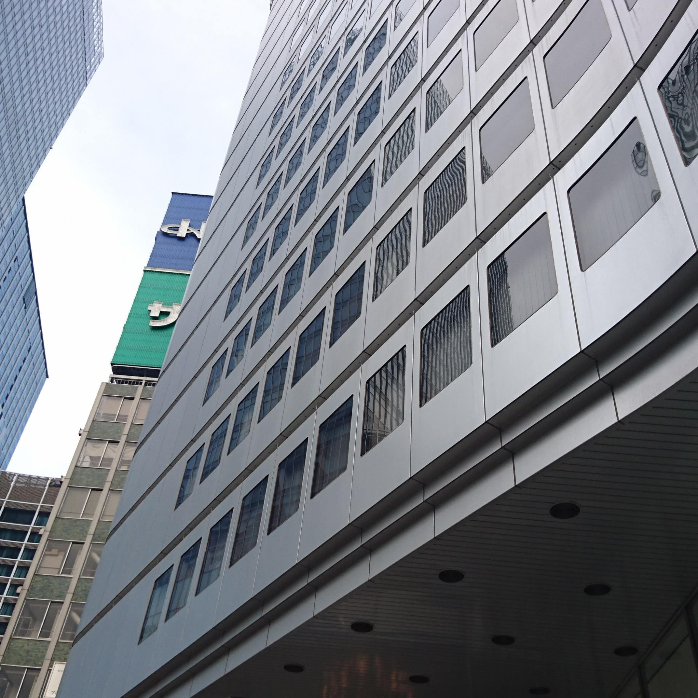
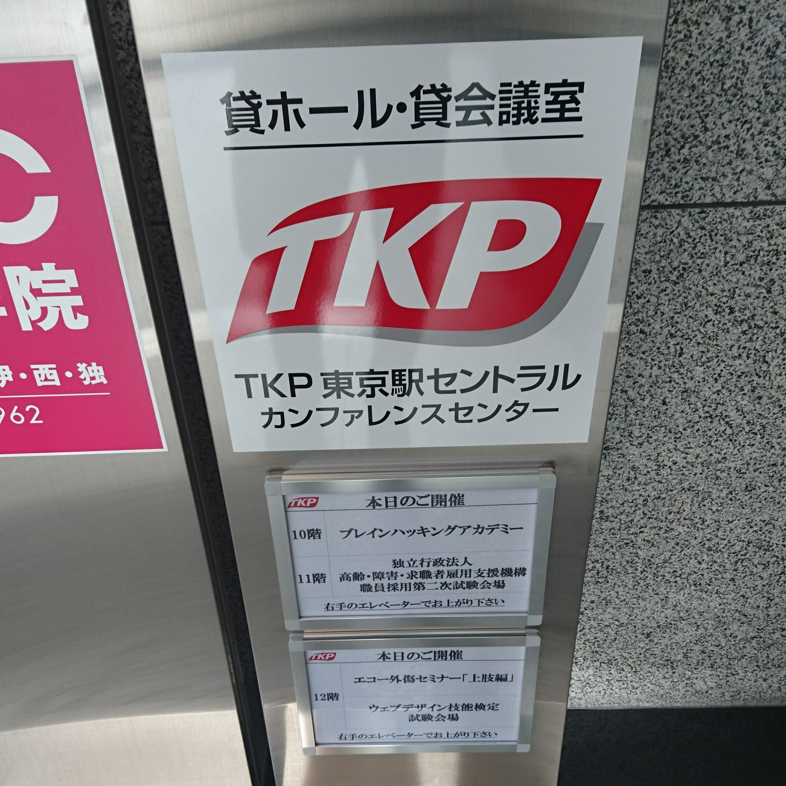
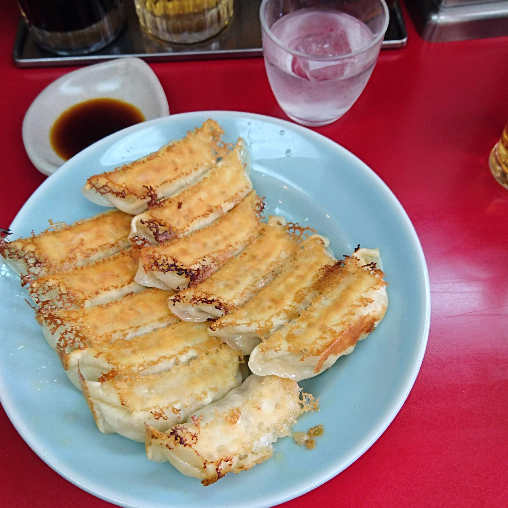

この記事は、 [Yamagata Developers Society Advent Calendar 2019](https://adventar.org/calendars/4619) 5日目の記事です。

はじめまして、松田です。  
社会人3年目で、クラウド在庫管理ソフトの開発をしています。  
主戦場はRuby on Rails、たまにJavaScriptです。どうぞよろしくお願いします。 

# ウェブデザイン技能検定とは？

ウェブサイト：https://www.webdesign.gr.jp/

>ウェブデザイン技能検定は、国家検定制度である技能検定制度の一つとして、厚生労働省より職業能力開発促進法第47条第１項の規定に基づき指定試験機関の指定を受け、特定非営利活動法人インターネットスキル認定普及協会（以下、当協会）が実施するものです。
試験は実技および学科試験で実施され、関連国際標準規格等に基づきウェブデザインに関する知識・技能、実務能力等が問われます。１級の合格者には厚生労働大臣より、２級及び３級の合格者には当協会理事長より、ウェブデザイン技能士の合格証書が発行されます。
  
つまりまとめるとこんな感じです。

+ ウェブ系の国家資格（職業能力開発促進法に基づく）
+ 1～3級まである
+ どの等級にも実技試験と学科試験がある

今回はウェブデザイン技能検定の1級を受けてきたのでその報告です。

# ウェブデザイン技能検定1級について

ウェブデザイン技能検定 試験概要：https://www.webdesign.gr.jp/kentei/guide.html  
1級や2級を受ける場合は「受検資格」があるので、これをクリアしている必要があります。  
1級の場合は以下のようです。  

>【実技試験】
・1級の技能検定において、学科試験に合格した者（※1）
【学科試験】
・7年以上の実務経験（※2）を有する者
・職業高校、短大、高専、高校専攻科、専修学校、各種学校卒業又は普通職業訓練修了（※3）後、5年以上の実務経験（※2）を有する者
・大学（※3）卒業後、3年以上の実務経験（※2）を有する者
・高度職業訓練修了（※3）後、1年以上の実務経験（※2）を有する者
・2級の技能検定に合格した者であって、その後2年以上の実務経験（※2）を有する者

色々ありますが、7年以上の実務経験があれば間違いなく受けられます。  
私は2級の技能検定に合格しているので、「2級の技能検定に合格した者であって、その後2年以上の実務経験（※2）を有する者」に該当します。  
実技試験を受けるには、まず学科試験を受ける必要があります。  

# 学科試験の受験対策

ウェブデザイン技能検定の1級は、基本情報技術者などと違って対策本がありません。  
ただし、過去問が3年分公表されているので、これを2回くらい解きました。  
https://www.webdesign.gr.jp/kentei/publication.html

それでもまだまだわからないことが多いので、似たような資格の対策本を購入しました。  
https://www.amazon.co.jp/dp/479815461X/  
（HTML教科書 HTML5プロフェッショナル認定試験 レベル1 スピードマスター問題集 Ver2.0対応 株式会社富士通ラーニングメディア）  
こちらは1回しか解いていないです(笑) もう少し解けば良かったと後悔...

# 試験当日

1級は東京だけで行われるので、山形から遠路はるばる向かう必要があります。  
12:15に受付開始、12:30までに受付を済ませる必要があります。  
13:00に受験がはじまり、15:00に終わりです。  
受験者の方は30名くらいでした。  

▽会場のビル、東京駅八重洲口からすぐ

▽会議室を貸し切ってやるんですね〜

# 結果はいかに！？

記事を書いた時点では結果はまだです。結果発表は12月下旬だったかな？
手応えがないので、ポケモンでもやって気楽に過ごしていようかな？？？(現実逃

# おわりに

私の場合は実務経験が浅いので、なんとか勉強でカバーしたいわけですが、社会人で **仕事をやっているとそう簡単にはいかない** ですね...  
それでもHTMLやJavaScriptを改めて勉強すると、 **こんな仕様があったのか！** と思わぬ発見が得られるのでとても勉強になりました。  
「ウェブデザイン」という言葉から意匠に関する知識を求められると思いますが、出題のほとんどが開発や運用についてです。  
もしPHPやJavaScriptの実務経験がある方は受験されると良いと思います。  
それではまた、冬も本番になってきたようなのでお体に気をつけてお過ごしください😀

# おまけ

▽宇都宮みんみんの餃子。ちょっと寄り道♪

